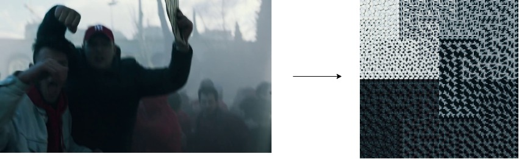

## Encryption using [Space Filling Curves](https://en.wikipedia.org/wiki/Space-filling_curve)


This project is aimed to create an algorithm to prevent the Choosen Plain Text Attack on Space Filling Curves.  
With the help of that algorithm we would be encrypting videos using Selective Frame Encryption.


### Project Files

* `capture_frames.py` 
	* This files uses OpenCV and other tools to capture a particular frame.
	* It takes the location of the video through commandline arguments.
	* It then capture frames at every 6 seconds interval.
	* Output frames are then saved in the `Frames` folder.
	* The code has been provided with relevant comments for further information.

--- 

### Installation 

#### Use Python 3x

#### Clone the repository
```bash
$ git clone https://github.com/ab-anand/Video-Encryption.git
``` 

#### Move inside the folder
```bash
$ cd Video-Encryption
``` 

#### Install virtual environment:
```bash
$ virtualenv -p python3 envname
``` 
#### Activate the environment: 
```bash
$ source envname/bin/activate
``` 
#### Install the requirements using requirements.txt file: 
```bash
$ pip install -r requirements.txt
``` 

#### Run the file: 
```bash
$ python capture_frames.py playback.mp4
``` 


---

### Milestones of the Project

- [x] <b>Capturing Frames</b>
	- <i>Getting particular frames from a given video</i>.
- [ ] <b>Strategy for selecting frames</b>
	- <i> Deciding algorithm for selecting frames for `Selective Frame Encryption`</i>.
- [ ] <b>Scrambling the frames</b>
	- <i>Using SFCs to encrypt the acquired frame</i>.
- [ ] <b>Putting back the Frames</b>
	- <i>Pushing the scrambled frames back in the output video</i>.